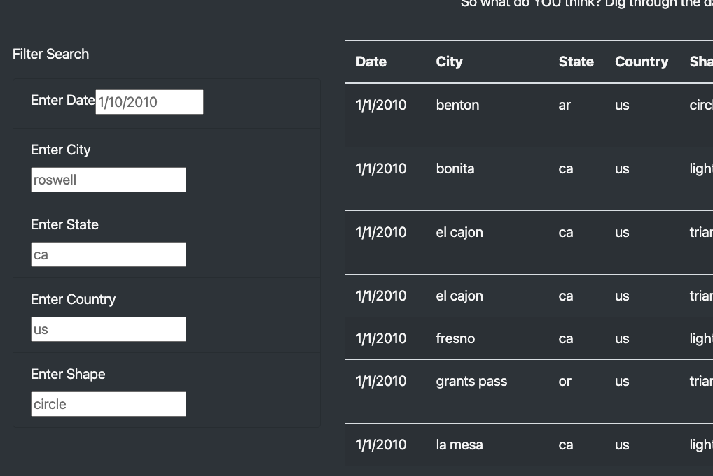
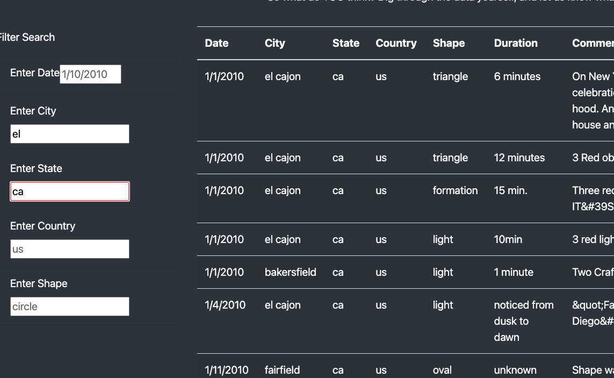

# UFO

## 1. Overview of Project: 

To display research data based on UFO sightings in the USA. Adding table filters of Data, City, State, Country and Shape description to make it a more interactive webpage. allowing users to filter the data with more detail. 

## 2. Results: 
Additonal table filters were added to the page to filter the city, state, country, and shape.

     
When user type in the keyword in the input fields: 

 For example, when user wants to research the UFO sighting based on the city location of `el cajon` and state of `ca`, (even the user type in part of the city name), once the user hits the 'ENTER' key, the webpage will automatically update the table with the filtered data.

## 3. Summary: 

One drawback of this new design is that, the searching functionality can only be triggered by hitting the 'ENTER' key. Otherwise, the searching & filtering won't happen.
    
Some future imporvements are:

    1.There should be some searching failure message to alert the user.

    2.Since US is the only country listed in the table, "eneter a Country" input field should be removed. Or database should be expanded to include the information worldwide.